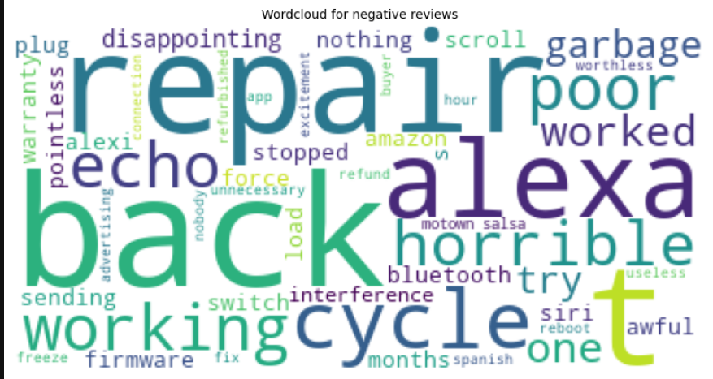

# Amazon Alexa Review - Sentiment Analysis

This project focuses on classifying the sentiment of Amazon Alexa product reviews (positive or negative) using machine learning models. The goal is to predict customer feedback based on the textual review provided.

## Introduction
The dataset contains reviews of Amazon Alexa products, including customer ratings and feedback. The project explores various models to classify whether a review is positive or negative based on feedback labels (0 for negative, 1 for positive).

## Data Preprocessing
Key preprocessing steps include:
- **Stopword Removal**: Removed common English words (stopwords) that don't contribute to sentiment analysis.
- **Stemming**: Used PorterStemmer to reduce words to their base form.
- **Vectorization**: Transformed the text data using CountVectorizer for feature extraction.
- **Scaling**: Used MinMaxScaler to normalize the data for model training.

## Exploratory Data Analysis
- Analyzed features such as review length, rating distribution, and feedback value counts.
- Visualized data using bar plots and pie charts to observe the distribution of ratings and feedback.
- Generated word clouds to identify common terms in positive and negative reviews.
- Observed that detailed reviews are more likely to be positive.

#### Rating Distribution

#### Review Length Distribution (Positive Reviews)

#### Review Length Distribution (Negative Reviews)

#### Positive Reviews Word Cloud

#### Negative Reviews Word Cloud

## Modeling
The following machine learning models were trained:
1. **Random Forest Classifier**:  
   Achieved the highest accuracy of 94.50% on the test set. It was selected as the final model due to its stability and performance.
   
2. **Decision Tree Classifier**:  
   Performed well but showed signs of overfitting.

3. **XGBoost Classifier**:  
   Competitive performance but slightly lower accuracy than Random Forest.

The Random Forest model was saved as `model_rf.pkl` for future use, along with the CountVectorizer (`countVectorizer.pkl`) and MinMaxScaler (`scaler.pkl`).

## Results
- **Training Accuracy (Random Forest)**: 100%
- **Testing Accuracy (Random Forest)**: 94.50%
- **Confusion Matrix**: Displayed the performance of the models in predicting sentiment.

#### Confusion Matrix

## Conclusion
The Random Forest model was chosen for its high accuracy and better generalization compared to other models. It effectively classifies the sentiment of Amazon Alexa product reviews, helping businesses understand customer opinions and improve product experiences.

---

